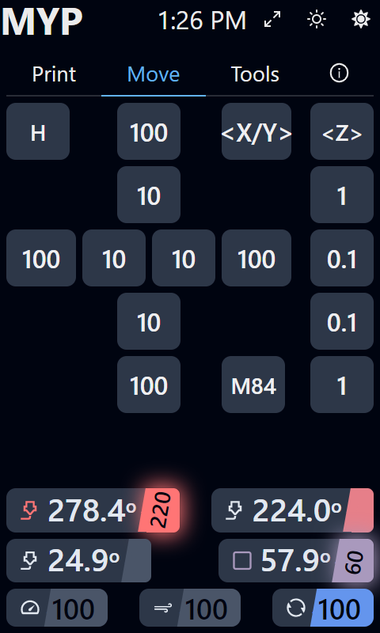
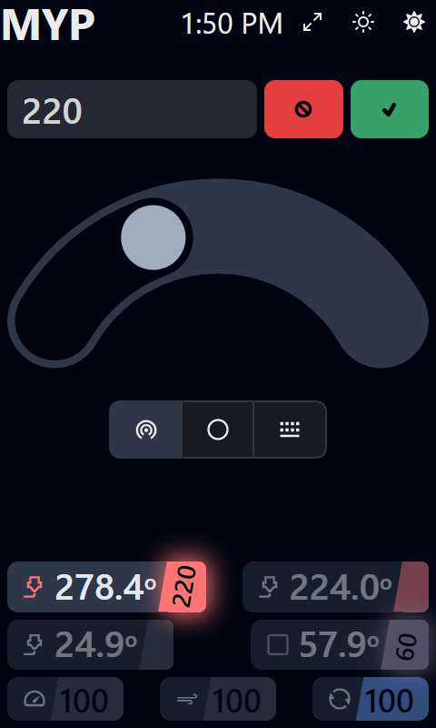
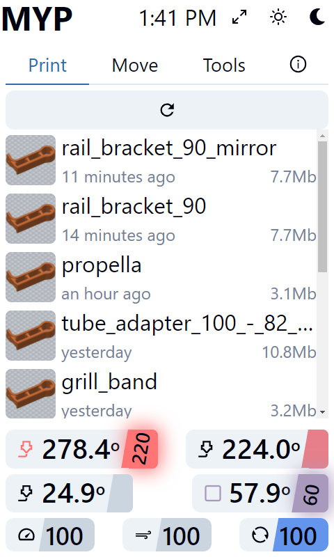

# Printer interface

A user interface for [klipper](https://github.com/KevinOConnor/klipper) based 3d printers, it is intended to run on the printers raspberry pi with a touchscreen.

## WIP

This project is a work in progress.

## Storybook

Storybook is used in this project to allow development of components in isolation and avoid the need for a connection to working printer. It is also a good way to get a feel for the interface.

To run the storybook.

- Clone the repo
- install dependencies with ```yarn```
- then start storybook with ```yarn storybook```

## Screenshots

### Main screen



### Adjusting temperature



### File select


